# Digital Design & Computer Architecture  
## Onur Mutlu — Lecture Series  

---

### L1: Fundamentals, Transistors, Gates

#### Transformation Hierarchy  

<p align="center">  
  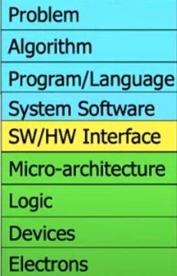  
</p>

 This is an overview of the abstraction layers in computer systems, ranging from high-level problem solving to the physical implementation of computing. Each layer from top to bottom represents:

- Problem: The real-world task or need to be solved using computing.
- Algorithm: A step-by-step method to solve the problem logically.
- Program/Language: The implementation of the algorithm using a programming language.
- System Software: Operating systems and tools that help manage hardware and
software resources.
- SW/HW Interface: Defines how software communicates with hardware (e.g., through instruction sets).
- Micro-architecture: The design of processor components and how instructions are executed at the hardware level.
- Logic: Logic gates and circuits that perform basic operations.
- Devices: Physical components like transistors and memory cells.
- Electrons: The fundamental particles and electrical activity enabling all computation.
#### :mag_right: Types of Systems:

- **General Purpose**: Flexible and programmable (e.g., CPUs), but less efficient.
- **Special Purpose**: Highly efficient (e.g., GPUs, ASICs), but limited to specific tasks.

#### :mag_right: Computer
<p align="center">
  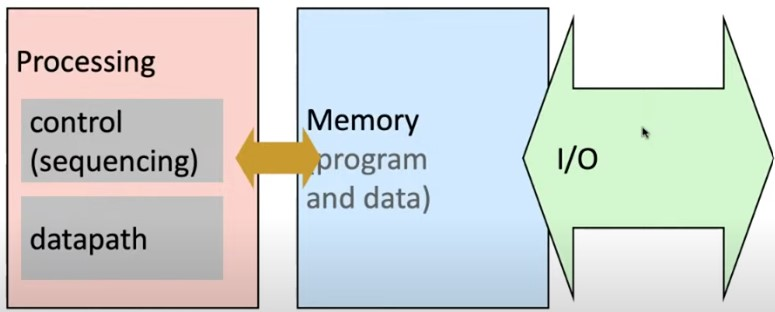
</p>

#### :mag_right: Why Do We Need Computers?  
- to solve problems
- to gain insight
- to enable a better life and future

#### :mag_right: How does Computer solve Problems?  
Computers solve problems by **orchestrating electrons** to perform complex tasks.

#### :mag_right: What is Computer Architecture?
The science and art of designing, selecting, and interconnecting hardware components and designing the hardware/software interface to create a computing system that meets **functional, performance, energy consumption, cost**, and other specific goals.

#### :mag_right: Why study Computer Architecture?
- Enable better solutions
- Enable new applications
- Enable better systems

#### :memo: Note on Hardware vs Software:
 
- Can develop better software if we understand the hardware.
- Can design better hardware if we understand the software.
- Can design a better computing system if we understand both.

#### :mag_right: Building Blocks of Computer
- **Transistors**
<p align="center">
  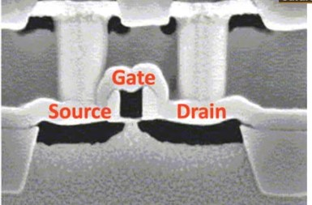
</p>

  - **1. MOS Transistor:**
    - Built using:
      - **Conductors** (Metal)
      - **Insulators** (Oxide)
      - **Semiconductors**
    - Types:
      - **N-type** (good at pulling dow**n** the voltage)
      - **P-type** (good at pulling u**p** the voltage) 
<p align="center">
  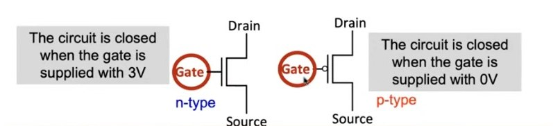
</p>

- **Logic Gates**
Modern Computer uses both n-type and p-type transistors i-e Complementary MOS called **CMOS Technology**.
<p align="center">
  
</p>


  - **CMOS NOT Gate**  
 It consists of 1 p-type transistor connected to high voltage to pull up the voltage,  
    and 1 n-type transistor to pull down the voltage.
      
    - **Digital Design:**   
      - Interprets 0V as binary 0  
      - Interprets 1V as binary 1  
<p align="center">
  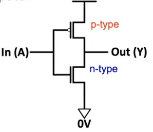
</p>
<p align="center">
  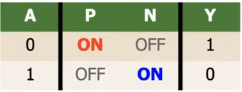
</p>

- **CMOS NOT Gate (Inverter)**  
  It consists of 2 p-type transistors  
    and 2 n-type transistors.
    - P1 and P2 are in parallel,only one must be **ON** to pull up the voltage to 3V.
    - N1 and N2 are connected in series,both must be **ON** to pull down the voltage to 0V.  
  - **Digital Design:**  
    - Interprets 0V as binary 0  
    - Interprets 1V as binary 1  


<p align="center">
  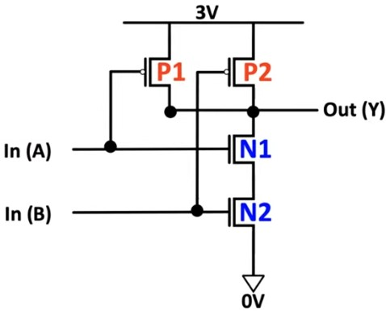
</p>
<p align="center">
  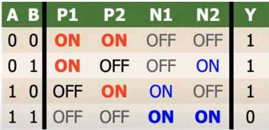
</p>

--- 

### L2: Combinational Logic
#### :mag_right: Moore's Law:
- Not a physical law — it's a **trend** based on observation.
- Implies **exponential growth** in computing performance.
- Leads to:
  - Smaller, faster, more energy-efficient processors.
  - Rapid evolution of digital technology.

#### :mag_right: Logic Circuits:
A logic circuit is composed of:
- **1** Inputs
- **2** Outputs
- **Functional Specificaiton** describes the relationship between inputs and outputs.
- **Timing Specification** describes the delay between inputs changing and outputs responding.

##### Combinational Logic Circuits:
- Memoryless.
- Outputs are strictly dependent on combinations of inputs.

#### :mag_right: Boolean Logic Algebra:
| **Law**                      | **OR Operation ( + )**            | **AND Operation ( · )**               |
| --------------------------- | --------------------------------- | ------------------------------------- |
| **Identities**           | A + A = A                         | A · A = A                          
| **Commutative Law**          | A + B = B + A                     | A · B = B · A                         |
| **Distributive Law**         | A · (B + C) = A · B + A · C       | A + (B · C) = (A + B) · (A + C)       |
| **Complement**  | A + A' = 1                        | A · A' = 0                            |
####  :mag_right: Duality in Boolean Algebra

**Duality** is a principle in Boolean algebra where every algebraic expression remains valid if we:

1. **Swap AND (·) with OR (+)**
2. **Swap 0 with 1**, and vice versa

#### :mag_right: Useful Laws 


**Demorgon's Law** is really important for simplifying expressions.
<p align="center">
  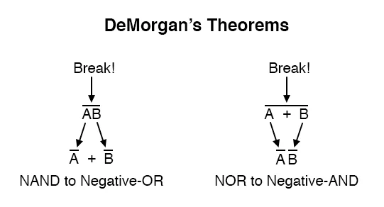
</p>

Some useful laws, worth remembering for real designs are:

<p align="center">
  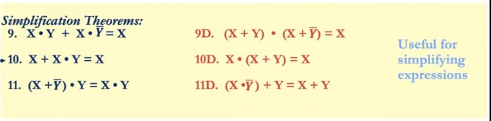
</p>

####  :mag_right: Standardized Function Representations
**1** - SOP : Sum of Products

SOP stands for **Sum of Products**.  
It is a Boolean expression where several **AND** terms are connected using the **OR** operation.

**2** - POS : Product of Sums

POS stands for **Product of Sums**.  
It is a Boolean expression where several **OR** terms are connected using the **AND** operation.

####  :mag_right:  Combinational Building Blocks
**Decoders**:

- Produces 2^n outputs from n inputs.
- Exactly one of the outputs is **1** and rest are 0s.
- Useful in determining how to interpret bit pattern.

**Multiplexers or Selectors**:

- Selects **1 output from many inputs**.
- Controlled by selector lines.
- Used for: data routing, control logic,can be used as lookup tables.

**Adders**:

- **Full Adder**:

  - Adds three bits: A, B, and Carry-in (Cin)
  - Outputs: **Sum** and **Carry-out (Cout)**
  - **Sum** = A ⊕ B ⊕ Cin
  - **Carry-out (Cout)** = Majority(A,B,Cin)

- **Ripple Carry Adder** 
  - Connects **multiple full adders** in series.
  - Carry-out of one becomes carry-in of the next.
  - Used to add multi-bit binary numbers.
  - **Slower** due to carry propagation delay (ripple effect).

#### Programmable Logic Arrays (PLAs):
Any logic function we want to implement could be implemented using PLA.
- Made up of array of AND Gates followed by array of OR Gates
  - **AND stage** : creates input combinations (minterms).
  - **OR stage** : combines those combinations to get final outputs.


---
### L3: Sequential Logic
####  :mag_right: More Combinational Blocks
 **Comparators** (Equality Checkers):
- Compare two N-bit values.
- Output is **1** if all bits match.
- Use **XNOR** for each bit pair.
- **AND** all XNOR results for final output.

**Arithmetic Logic Unit (ALU):**

- Performs **arithmetic** and **logic** operations  
- Operation is selected using **function bits**  
- Output depends on the selected operation

Some more combinational blocks are:
- **Subtractor**
- **Shifter and Rotator**
- **Multiplier**
- **Divider**

####  :mag_right: Tri State Buffer
A tri-state buffer enables gating of different signals onto a wire.
<p align="center">
  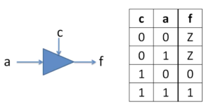
</p>

- **Floating signal(Z)** is not driven by any circuit.
- it acts like a **switch**.
- if c is 1 , a is connected to f and if c is 0, a is not connected to f.

####  :mag_right: Storage Elements
**RS Latch**
- cross-coupled **NAND** gates.
- data is stored at Q.
- **S** and **R** are controlled inputs.
- in idle state,both inputs are at 1. 
<p align="center">
  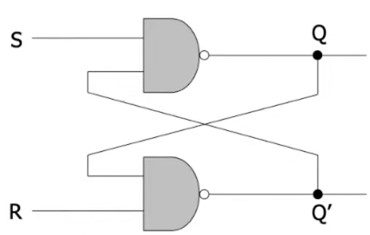
</p>

<p align="center">
  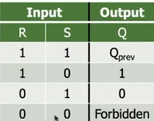
</p>

**Gated RS Latch**
Add two more **NAND** gates.

- it adds a **Write Enable (WE)** input
- when **WE = 0** ,latch is disabled,it sustains the value.
- when **WE = 1** , S̅ and R̅ control the latch.

<p align="center">
  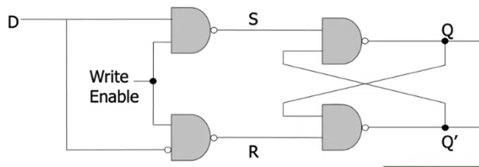
</p>

<p align="center">
  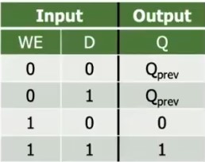
</p>

**Registers**
To store more data:
  - adds more D latches.
- single WE for all latches.

**Memory**
- comprises of locations that can written or read from.
- each unique location is mapped by unique address.
- **no. of address bits** = **log[no. of locations]**
- **addressability** : no. of bits stored in each location
- **Read/Write**:
  - **Read**: Multiplexer selects the data from the addressed location.
  - **Write**: Decoder enables the selected wordline to store new data,and WE=1.
##### READ
<p align="center">
  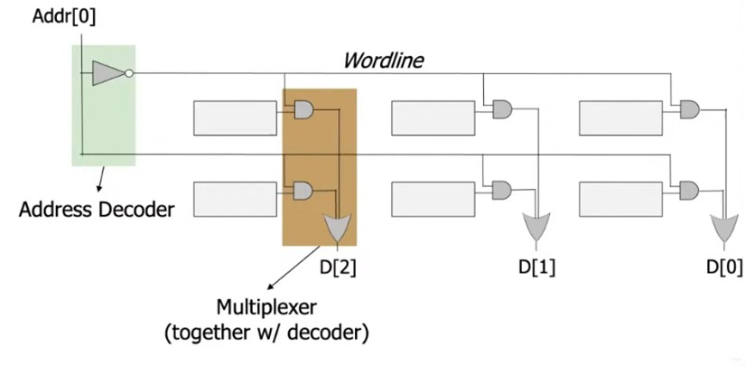
</p>

##### WRITE
<p align="center">
  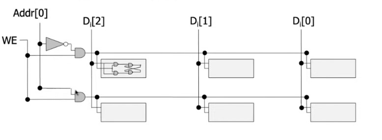
</p>

####  :mag_right: Sequential Logic Circuits

**State**:
 A state refers to snapshot of all relevant elements of system at moment of the snapshot.

**Finite State Machines(FSMs)**:
  FSM consists of:
  - next state logic
  - state register
  - output logic
at begining of next clock cycle,next state is latched into the state register.
<p align="center">
  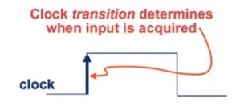
</p>

####  :mag_right: Problems with Latches in Sequential Circuits
Latches are basic memory elements, but they have some drawbacks:
**1. Level Sensitivity**
- Latches are **level-triggered**, not edge-triggered.
- Output can change **as long as the enable is active**, which can lead to unpredictable behavior.

**2. Glitches and Unstable Output**
- If inputs change while the latch is enabled, output may glitch.
- Causes **unintended or incorrect outputs**.

**3. Timing Hazards**
- Difficult to control in synchronous systems.
- May cause **race conditions** and **timing violations**.

so flipflops are used.

####  :mag_right: D Flip-Flop
- Stores **one bit** of data.
- Transfers input (**D**) to output (**Q**) **only on a clock edge**.
- data is latched on the **rising or falling edge** of the clock signal.
- **Q = D** at the triggering clock edge.
<p align="center">
  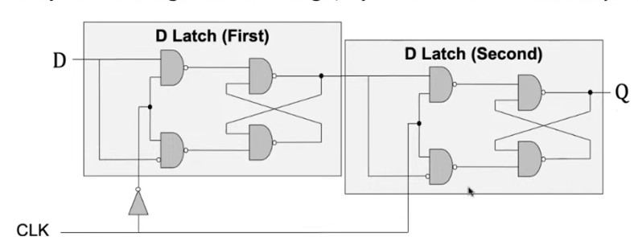
</p>


---

### L4 : Encoding
####  :mag_right: FSM State Encoding:
**Binary Encoding**
- Each state is assigned a unique binary number.
- Uses minimum possible number of bits
-  States are represented using **log₂(N)** bits.
- minimizes number of flipflops
- may result in slower circuits due to complex logic.

**One Hot Encoding**
- one flip-flop per state.
- only **one flip-flop is '1'**, all others are '0'.
- faster, simpler logic, but uses more hardware.

**Output Encoding**:
  - Outputs are ** directly accessible in state encoding**.
  -minimizes output logic.
  - useful in Moore machines.
####  :mag_right:FSM Design Steps  

1. **List All States**  
   - Identify every possible state of the system.

2. **Draw State Transition Diagram**  
   - Use a description to define states, transitions, inputs, and outputs.

3. **Design Approach**  
   - Start from a **reset state** (initial state).
   - Add **transitions** and **new states** as needed.
   - Use **clear and meaningful state names**.
   - Think of FSM like programming:
     - States act like steps in a control flow.
     - Transitions are like `if-else` based on inputs.
     - Outputs depend on current state or inputs.

---
L5:
#### :mag_right: HDL Implementation
**Structural (Gate-Level)**

- The module body contains **gate-level description** of the circuit  
- Describe how modules are interconnected  
- Each module contains other modules (instances) … and interconnections between those modules  
- Describes a hierarchy of modules defined as gates  

```verilog 
module and_gate_structural (
    input wire a,
    input wire b,
    output wire y
);
    and and1 (y, a, b);  // Using primitive gate
endmodule
```
**Behavioral**

- The module body contains **functional description** of the circuit.
- Contains logical and mathematical **operators**.
- Level of abstraction is **higher** than gate-level.  

```verilog
module and_gate_behavioral (
    input wire a,
    input wire b,
    output wire y
);
    assign y = a & b;  // Functional description
endmodule
```

**Blocks and Sensitivity List**

- Whenever the event in sensitivity list occurs,the statement is executed.
```verilog
always @(sensitivity_list) begin
    //statements
end
```
- Assigned variables need to be reg.
```verilog
module a(input clk ,reg [2:0]y);

always @(posedge clk) begin
    y = a & b;
end
endmodule
```
**Synchronous vs Asynchronous Reset**
**1. Synchronous Reset**

- The **reset** is checked **along with the clock**.
- The effect of reset happens **only on the clock edge**.

```verilog
always @(posedge clk) begin
    if (rst)
        q <= 0;
    else
        q <= d;
end
endmodule 

```
**1. Asynchronous Reset**

- The **reset** is independet of  **  clock**.
- The effect of reset can happen **anytime**.
```verilog 
always @(posedge clk or posedge rst) begin
    if (rst)
        q <= 0;
    else
        q <= d;
end
```
**Blocking Assignment (`=`)**

 Assumption:
- All inputs (`a`, `b`, `cin`) are initially `'0'`.

```verilog
always @(*) begin
    p = a ^ b;            // p = 0  → (if a changes to 1 → p = 1)
    g = a & b;            // g = 0
    s = p ^ cin;          // s = 0  → (p is now 1 → s = 1)
    cout = g | (p & cin); // cout = 0 → (g=0, p=1, cin=0 → cout = 0)
end
```
**Non-blocking Assignment (`<=`)**

 Assumption:
- `a = 0`, `b = 0`, `cin = 0`

```verilog
always @(*) begin
    p <= a ^ b;            // RHS uses old a, b
    g <= a & b;            // RHS uses old a, b
    s <= p ^ cin;          // RHS uses old p and cin
    cout <= g | (p & cin); // RHS uses old g, p, cin
end
```
---

### L6: Sequential Circuit Timing:

##### Flip-Flop Timing Parameters:

- **Setup Time (`t_setup`)**:  
  The minimum duration for which the data input must remain stable **before** the clock edge arrives to ensure correct sampling.

- **Hold Time (`t_hold`)**:  
  The minimum duration for which the data input must remain stable **after** the clock edge to guarantee data is properly latched.

- **Contamination Delay (`t_ccq`)**:  
  The earliest time after the clock edge when the output `Q` may begin to change (the output starts to become unstable).

- **Propagation Delay (`t_pcq`)**:  
  The latest time after the clock edge when the output `Q` becomes stable and valid.


##### Timing Constraints:

- **Setup Time Constraint**  
  To ensure correct data capture, the clock period (`T_c`) must be longer than the sum of:

  - The maximum delay from the previous flip-flop output to the current flip-flop input (`t_pd`),  
  - The flip-flop propagation delay (`t_pcq`),  
  - The flip-flop setup time (`t_setup`).

  Formally:

  \[
  T_c > t_{pcq} + t_{pd} + t_{setup}
  \]

- **Hold Time Constraint**  
  To avoid data corruption, the shortest delay path must be long enough so that data does not change too soon after the clock edge. Specifically:

  - The contamination delay from clock to output (`t_ccq`) plus the minimum combinational delay (`t_cd`) must be greater than or equal to the flip-flop hold time (`t_hold`).

  Formally:

  \[
  t_{ccq} + t_{cd} > t_{hold}
  \]


##### Additional Notes:

- Violating **setup time** causes the flip-flop to capture incorrect or unstable data, leading to functional errors.
- Violating **hold time** causes data to change too early, possibly corrupting the value latched on the clock edge.
- Designers often add delay buffers or adjust paths to satisfy hold time constraints.


---
